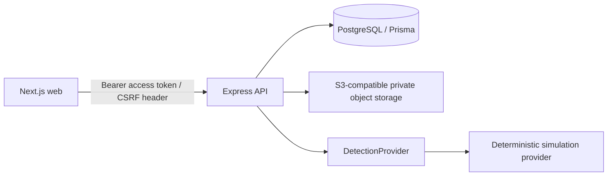

# Sentinel — Content Usage Tracking System

Sentinel is a security-conscious SaaS platform for creators to inventory private content, simulate web-usage detection, and review actionable alerts.

## Architecture

## Local setup

1. Install Node 22+ and pnpm 9+.
2. Copy `.env.example` to `.env`, replacing both JWT secrets with random 32+ character values.
3. Run `docker compose up -d postgres`, then `pnpm install`.
4. Run `pnpm --filter @cut/api prisma:generate`, `pnpm --filter @cut/api prisma:migrate`, and `pnpm --filter @cut/api seed`.
5. Run `pnpm dev`. Web: `http://localhost:3000`; API health: `http://localhost:4000/api/v1/health` (also available at `/health`).

Demo credentials: `demo@sentinel.local` / `DemoPassword123!`.

## Assumptions and operational notes

- The default detection provider is deliberately deterministic, for repeatable demos/tests. Replace `SimulationDetectionProvider` with a perceptual-hash or embedding implementation without changing its callers.
- Object storage is private. The API defines the environment boundary for S3-compatible storage; production upload completion must include signature/magic-byte validation and virus-scan gate before setting a record `AVAILABLE`.
- Email verification/password-reset token persistence is present in the schema. Connecting a transactional email provider is intentionally deployment configuration, not a browser-side mock.
- Deployment: web to Vercel; API Docker image to Render/ECS; managed Postgres. Set `COOKIE_SECURE=true`, HTTPS origins, and platform-managed secrets in production.

## Demo flow to record

1. Create an account and sign in; show secure, minimal auth errors.
2. Add content to the library and run a scan.
3. Open the dashboard and analytics ranking.
4. Review a generated high-confidence alert, then dismiss it.
5. Toggle dark mode and show mobile navigation.

See [API documentation](docs/API.md), [architecture notes](docs/ARCHITECTURE.md), and [security controls](SECURITY.md).
